1. Σύντομη περιγραφή της εφαρμογής

Οι κύριοι χρήστες της εφαρμογής, που θα αναπτύξουμε στο πλαίσιο της εργασίας μας, αποτελούνται από ενδιαφερόμενους που επιζητούν να αποκτήσουν συνδρομή σε ένα γυμναστήριο, τη γραμματεία του γυμναστηρίου και τέλος του προπονητές. Οι πελάτες μέσω της εφαρμογής θα έχουν τη δυνατότητα να επιλέξουν από μια πληθώρα προγραμμάτων και να εγγραφούν σε αυτό που ταιριάζει στη προσωπική τους επιθυμία. Θα έχουν τη δυνατότητα να κλείνουν τη θέση τους για το επόμενο μάθημα και με κάθε νέα κράτηση θέσης θα μειώνονται οι φορές που τους απομένουν στο προπονητικό πακέτο που έχουν αγοράσει (π.χ.12  φορές/μήνα). Επιπλέον, μέσω της εφαρμογής θα ενημερώνονται για το πρόγραμμα των προπονήσεων καθώς και για πιθανές αλλαγές σε αυτό. Η παρουσία της εφαρμογής δίνει την δυνατότητα στους συνδρομητές του γυμναστηρίου να ακυρώσουν εύκολα και γρήγορα την συμμετοχή τους σε κάποιο μάθημα που είχαν δηλώσει ότι επιθυμούν να παραβρεθούν. Με αυτόν τον τρόπο δεν δεσμεύεται η “φορά” που ξόδεψαν και είναι και πάλι διαθέσιμη για επόμενη χρήση. Η πληρωμή καθώς και η ανανέωση πακέτου γίνεται πάντα στο φυσικό χώρο του γυμναστηρίου. 

Οι εν δυνάμει χρήστες της εφαρμογής μας, χωρίζονται σε αυτούς που έχουν δημιουργήσει λογαριασμό και αποτελούν μέλη του γυμναστηρίου και στους απλούς επισκέπτες της οι οποίοι θέλουν να αποκομίσουν πληροφορίες σχετικά με το γυμναστήριο. Τα μέλη του γυμναστηρίου έχουν λογαριασμό και συνδέονται σε αυτόν με username και password, στοιχεία που αποκτούν με την συνδρομή τους. Μόλις συνδεθούν μπορούν να δουν αναλυτικά το πρόγραμμα του γυμναστηρίου καθώς και να επιλέξουν πότε θέλουν να πραγματοποιήσουν την επόμενη προπόνηση τους. Τα προσφερόμενα μαθήματα μπορούν να είναι είτε personal είτε ομαδικά. Τα ομαδικά μαθήματα θα αποτελούνται από συγκεκριμένο αριθμό ατόμων κι όταν συμπληρωθεί αυτός δεν μπορούν να δηλώσουν παραπάνω άτομα (π.χ. 10 άτομα). Ανάλογα με το πακέτο που θα αγοράσει κάποιος πελάτης έχει στη διάθεσή του έναν προκαθορισμένο αριθμό φορών που μπορεί να εισέλθει στο γυμναστήριο. Έτσι γίνεται αντιληπτό πως η συνδρομή εξασφαλίζει την είσοδο του πελάτη στο γυμναστήριο και κάθε φορά που εισέρχεται αφαιρείται μία προπόνηση από τον συνολικό αριθμό για τον οποίον έχει πληρώσει. Από την άλλη, ο απλός επισκέπτης της εφαρμογής, που δεν είναι μέλος του γυμναστηρίου μπορεί μόνο να περιηγηθεί σε αυτήν βλέποντας τα διαθέσιμα προγράμματα, την φιλοσοφία του γυμναστηρίου, τρόπους επικοινωνίας, τους προπονητές καθώς και ένα σύντομο βιογραφικό για καθέναν από αυτούς. Αυτή η κατηγορία χρήστη μπορεί να κάνει εγγραφή στην εφαρμογή μας δημιουργώντας έναν νέο λογαριασμό με την αγορά οποιουδήποτε προσφερόμενου προγράμματος γυμναστικής. Τότε θα έχει όλα τα πλεονεκτήματα και δυνατότητες που αναφέρθηκαν παραπάνω, τα οποία απολαμβάνει ο συνδρομητής του γυμναστηρίου. Ακόμη ένας χρήστης που θα χρησιμοποιεί την εφαρμογή αποτελεί η γραμματεία, μέσω της οποίας θα ενημερώνει τους πελάτες για τυχόν αλλαγές στο πρόγραμμα και τη γενικότερη λειτουργία του γυμναστηρίου. Επιπρόσθετα, χρήστες της εφαρμογής είναι και οι προπονητές του γυμναστηρίου, οι οποίοι είναι σε θέση να πληροφορούνται για την πληρότητα των μαθημάτων τους. 

2. Περιγραφή και τεκμηρίωση λειτουργιών 

Αρχική οθόνη
Mock-up: 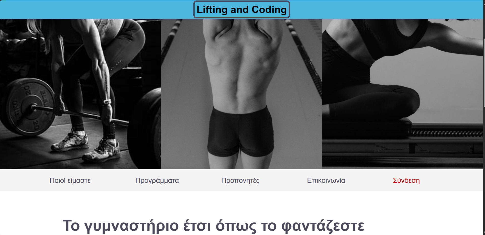 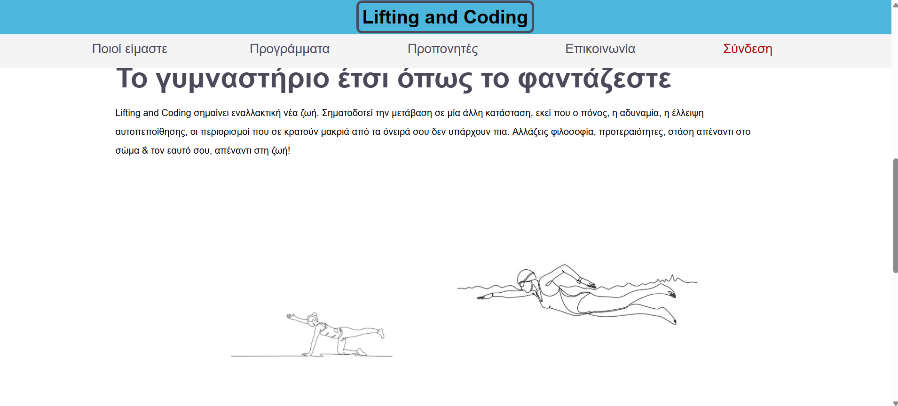 

Λειτουργία 1: Προβολή προγραμμάτων γυμναστηρίου
Περιγραφή: Η εφαρμογή εμφανίζει στο χρήστη μια λίστα με τα μηνιαία διαθέσιμα προγράμματα γυμναστικής.
Είσοδος: Ο χρήστης επιλέγει το κουμπί που αναγράφει ‘πρόγραμμα’  
Έξοδος: Ένας πίνακας με τη λίστα των προγραμμάτων. Κάθε εγγραφή στον πίνακα περιλαμβάνει: Όνομα προγράμματος, περιγραφή προγράμματος, στάδιο δυσκολίας, πλήθος εγγεγραμμένων χρηστών
Mock-up: 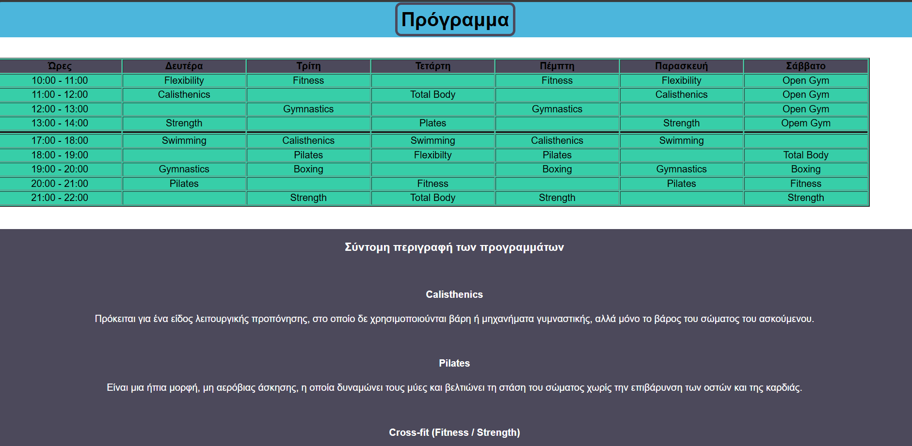

Λειτουργία 2: Είσοδος χρήστη στο προφίλ του
Περιγραφή: Επιτρέπει τη δήλωση στοιχείων μελών του γυμναστηρίου ώστε να έχουν πρόσβαση στο λογαριασμό τους
Είσοδος χρήστη: Το μέλος πατάει το κουμπί login και ξεκινάει η διαδικασία εισόδου στο προφίλ του
Έξοδος: Μια φόρμα δήλωσης απαραίτητων στοιχείων για την είσοδο στο λογαριασμό, username και password
Mock-up: 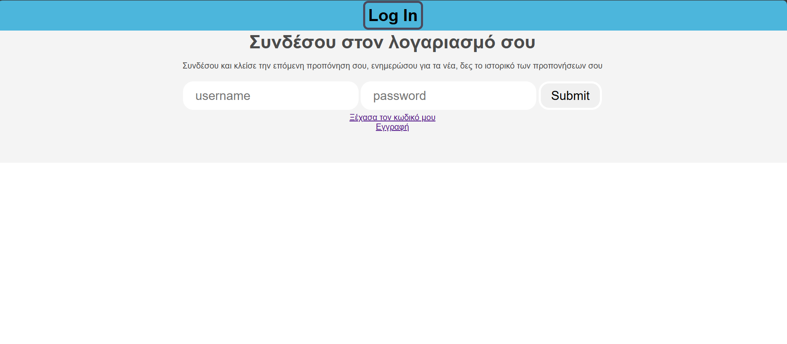

Λειτουργία 3: Κράτηση θέσης σε μάθημα
Περιγραφή: Επιτρέπει το ‘κλείσιμο’ συμμετοχής σε πρόγραμμα
Είσοδος χρήστη: Έχει προηγηθεί η επιτυχής δήλωση στοιχείων και πρόσβαση στον λογαριασμό του.  Αρχικά το μέλος κάνει ‘κλικ’ στο κουμπί δήλωσης που θα βρει στα αριστερά της σελίδας και στη συνέχεια εμφανίζεται η λίστα των προγραμμάτων και επιλέγει αυτό που το ενδιαφέρει. 
Έξοδος: Ένα μήνυμα επιβεβαιώνοντας τη κράτηση του μαθήματος καθώς και τη προβολή των ‘φορών’ που του απομένουν και δικαιούται να πραγματοποιήσει αναλόγως το πακέτο που έχει αγοράσει.
Mock-up: 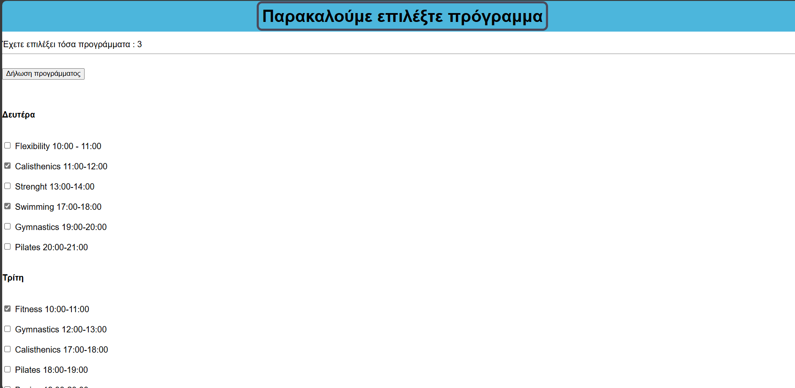

Λειτουργία 4: Ακύρωση κράτησης σε μάθημα
Περιγραφή: Επιτρέπει την ακύρωση μιας κράτησης που είχε πραγματοποιήσει και την ενημέρωση των ‘φορών’ που του απομένουν.
Είσοδος χρήστη: Έχει προηγηθεί η κράτηση μέλους σε μάθημα. Εφόσον επιθυμεί να την ακυρώσει κάνει ‘κλικ’ στο κουμπί δήλωσης που θα βρει στα αριστερά της σελίδας. Εκεί προεπιλέγει  την δήλωση που είχε πραγματοποιήσει.
Έξοδος: Ένα μήνυμα επιβεβαιώνοντας την ακύρωση κράτησης του μαθήματος καθώς και τη προβολή των ‘φορών’ που του απομένουν και δικαιούται να πραγματοποιήσει αναλόγως το πακέτο που έχει αγοράσει.
Mock-up: 

Λειτουργία 5: Ενημερώσεις γραμματείας προς τους συνδρομητές του γυμναστηρίου
Περιγραφή: Δίνει στους συνδρομητές του γυμναστηρίου την δυνατότητα να ενημερωθούν για τυχόν αλλαγές στον τρόπο λειτουργίας του γυμναστηρίου καθώς και στα προγράμματα γυμναστικής που παρέχονται
Είσοδος χρήστη: Έχει προηγηθεί η επιτυχής δήλωση στοιχείων και πρόσβαση στον λογαριασμό του χρήστη.  Στη συνέχεια το μέλος κάνει ‘κλικ’ στο κουμπί “ανακοινώσεις” που θα βρει στα αριστερά της σελίδας.
Έξοδος:  Εμφανίζονται οι ενημερώσεις που έχει αναρτήσει η γραμματεία, από την πιο πρόσφατη προς την πιο παλιά.
Mock-up: 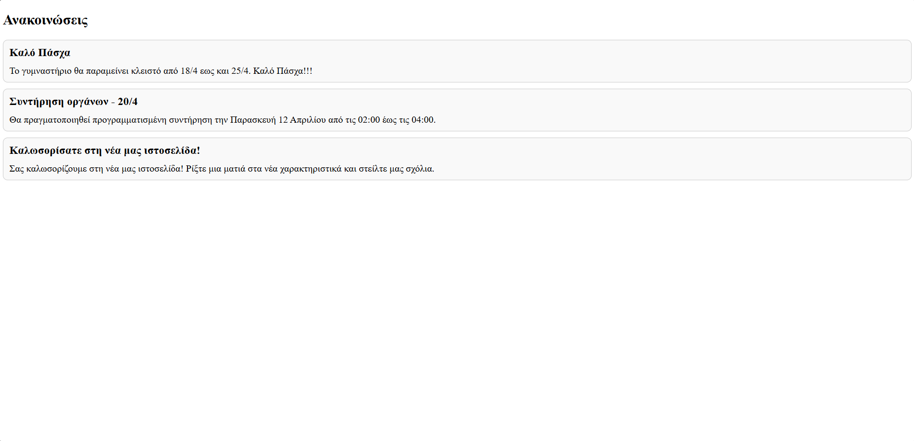

Λειτουργία 6: Προβολή βιογραφικών προπονητών
Περιγραφή: Δίνει στους συνδρομητές του γυμναστηρίου την δυνατότητα να ενημερωθούν με ένα σύντομο βιογραφικό για κάθε έναν από τους προπονητές του γυμναστηρίου
Είσοδος χρήστη: Ο χρήστης κάνει “κλικ” στο κουμπί “οι προπονητές” που θα βρει στα αριστερά της σελίδας
Έξοδος:  Εμφανίζονται σύντομα βιογραφικά με τις σπουδές καθώς και τα χρόνια εμπειρίας των γυμναστών
Mock-up: 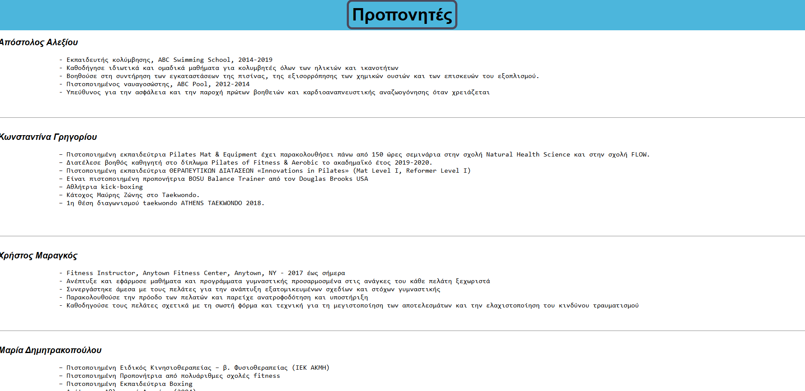

Λειτουργία 7: Η φιλοσοφία του γυμναστηρίου
Περιγραφή: Η εφαρμογή εμφανίζει στο χρήστη ένα κείμενο που περιγράφει την φιλοσοφία του γυμναστηρίου
Είσοδος: Ο χρήστης επιλέγει το κουμπί που αναγράφει ‘η φιλοσοφία μας’  
Έξοδος: Ένα κείμενο που εκφράζει τον τρόπο σκέψης του γυμναστηρίου Κάθε εγγραφή στον πίνακα περιλαμβάνει: Όνομα προγράμματος, περιγραφή προγράμματος, στάδιο δυσκολίας, πλήθος εγγεγραμμένων χρηστών
Mock-up: 

Λειτουργία 8: Ιστορικό προπονήσεων
Περιγραφή: Η εφαρμογή εμφανίζει στο χρήστη τα προγράμματα στα οποία είχε συμμετάσχει στο παρελθόν.
Είσοδος: Έχει προηγηθεί η επιτυχής δήλωση στοιχείων και πρόσβαση στον λογαριασμό του χρήστη. Τα μέλη κάνουν ‘κλικ’ στο κουμπί “ιστορικό προπονήσεων” που θα βρει στα αριστερά της σελίδας.
Έξοδος: Εμφανίζονται οι προπονήσεις που έχει συμμετάσχει στο παρελθόν.
Mock-up: 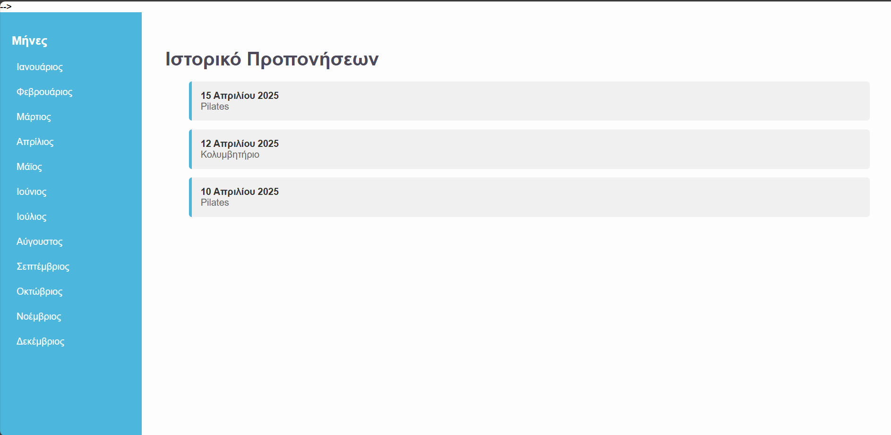

Λειτουργια 9: Δημιουργια νεου λογαριασμου 
Περιγραφή: Η εφαρμογή δίνει στον χρήστη την δυνατότητα δημιουργιας καινουριου λογαριασμου 
Εισοδος: Αρχικα ο χρηστης παταει το κουμπι της 'Συνδεσης' και στη συνεχεια το κουμπι 'Εγγραφη'.
Εξοδος: Εμφανιζεται μια φόρμα δήλωσης απαραίτητων στοιχείων για την δημιουργια λογαριασμου, ονομα χρηστη, email, κωδικος και την επιβεβαιωση του.Οταν εχουν συμπληρωθει τα προ αναφερωμενα ο χρηστης κανει την τελικη υποβολη κανοντας 'κλικ' στο κουμπι 'Εγγραφη'
Mock-up: 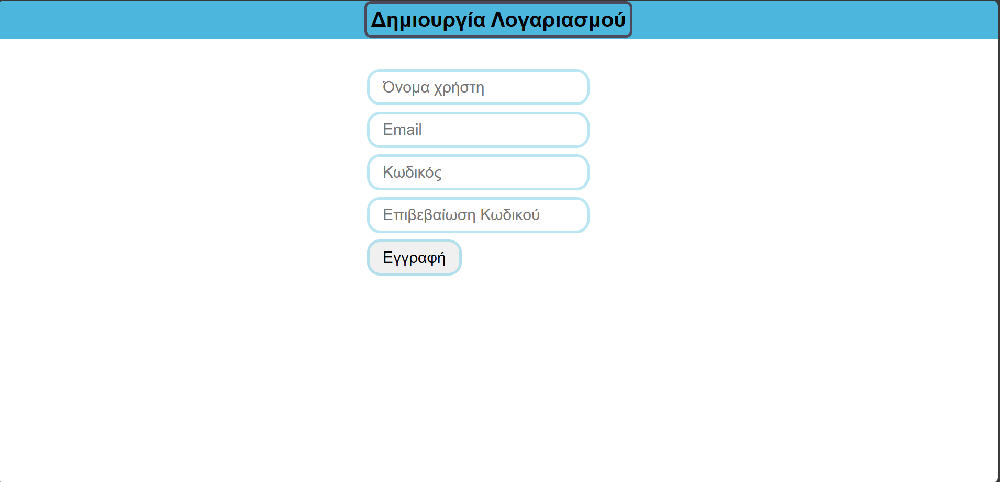

Λειτουργια 10: Ξεχασμενος κωδικος
Περιγραφη: Η εφαρμογη δινει τη δυνατοτητα στον χρηστη να κανει ανακτηση του κωδικου του.
Εισοδος: Αρχικα ο χρηστης παταει το κουμπι της 'Συνδεσης' και στη συνεχεια το κουμπι 'Ξεχασα τον κωδικο μου'.
Εξοδος: Εμφανιζεται μια φόρμα δήλωσης για το email του χρηστη και θα αναμενει την αποστολη του νεου κωδικου του.
Mock-up: 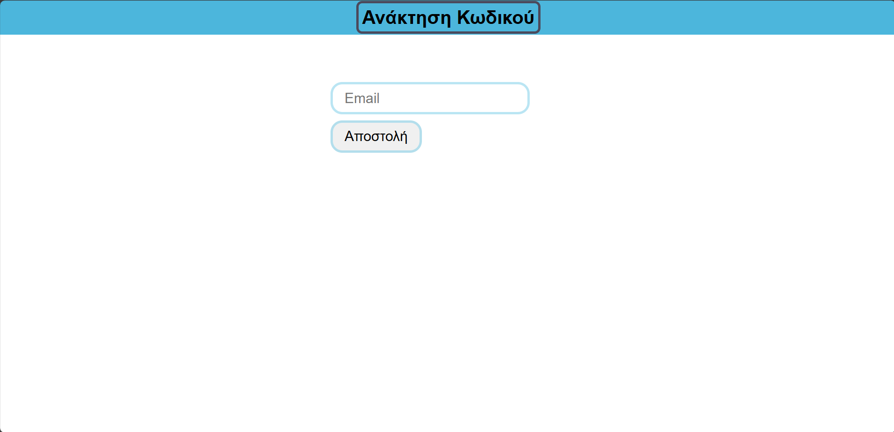

Λειτουργία 11: Περιβάλλον χρήστη

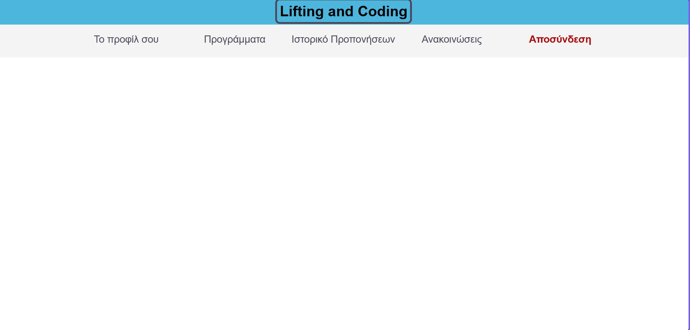

3. Σχήμα βάσης δεδομένων 

4. Django

superuser: lenia
users: irini , epameinondas

password: papaki12345678

