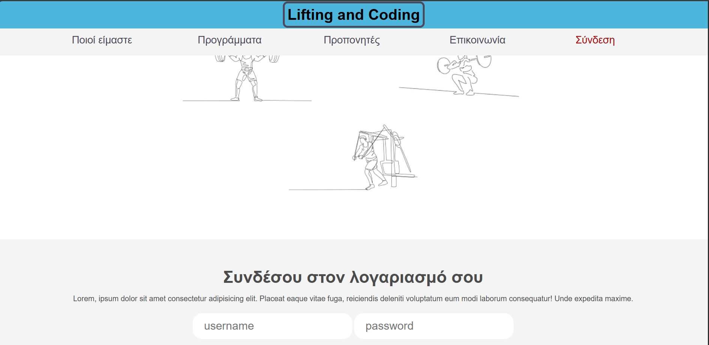

# ΔΕΥΤΕΡΟ ΠΑΡΑΔΟΤΕΟ

Σύντομη περιγραφή της εφαρμογής

Σημείωση, προς ενημέρωση σας η περιγραφή εχει αλλαξει στο μεγαλυτερο μερος της.

Οι χρήστες της εφαρμογής, που αναπτύξαμε στο πλαίσιο της εργασίας μας, αποτελούνται από ενδιαφερόμενους που επιζητούν να αποκτήσουν συνδρομή σε ένα γυμναστήριο. Οι πελάτες μέσω της εφαρμογής θα έχουν τη δυνατότητα να επιλέξουν από μια πληθώρα προγραμμάτων και να εγγραφούν σε αυτό που ταιριάζει στη προσωπική τους επιθυμία. Επιπλέον, μέσω της εφαρμογής θα ενημερώνονται για το πρόγραμμα των προπονήσεων καθώς και για πιθανές αλλαγές σε αυτό.
Οι εν δυνάμει χρήστες της εφαρμογής μας, χωρίζονται σε αυτούς που έχουν δημιουργήσει λογαριασμό και αποτελούν μέλη του γυμναστηρίου, και στους απλούς επισκέπτες της οι οποίοι θέλουν να αποκομίσουν πληροφορίες σχετικά με το γυμναστήριο. Τα μέλη του γυμναστηρίου έχουν λογαριασμό και συνδέονται σε αυτόν με username και password. Υπάρχει επίσης η δυνατότητα ανάκτησης κωδικού στην περίπτωση που το μέλος τον ξεχάσει (ελπίζουμε να μην τον ξεχάσετε γιατί δεν δουλεύει). Με την σύνδεση τους τα μέλη έχουν στη διάθεση τους 5 διαθέσιμες λειτουργίες. Να δουν τα στοιχεία του προφίλ τους, να αγοράσουν προπονήσεις, να επιλέξουν και προγραμματίσουν τις επόμενες προπονήσεις τους, να δουν πιθανές ανακοινώσεις του γυμναστηρίου αλλά και να αποσυνδεθούν από τον λογαριασμό τους.  Ανάλογα με το πακέτο που θα αγοράσει ο πελάτης, έχει στη διάθεσή του έναν προκαθορισμένο αριθμό φορών που μπορεί να εισέλθει στο γυμναστήριο. Έτσι, γίνεται αντιληπτό πως η συνδρομή εξασφαλίζει την είσοδο του πελάτη στο γυμναστήριο κι έπειτα επιλέγει  ο ίδιος από το πλήθος των διαθέσιμων προγραμμάτων. Από την άλλη, ο απλός επισκέπτης της εφαρμογής, που δεν είναι μέλος του γυμναστηρίου μπορεί μόνο να περιηγηθεί σε αυτήν βλέποντας τα διαθέσιμα προγράμματα, την φιλοσοφία του γυμναστηρίου, τρόπους επικοινωνίας, τους προπονητές καθώς και ένα σύντομο βιογραφικό για καθέναν από αυτούς. Αυτή η κατηγορία χρηστών έχει επίσης τη δυνατότητα δημιουργίας λογαριασμού.

Λειτουργίες

ΑΡΧΙΚΗ ΟΘΟΝΗ
Αρχικός σχεδιασμός

Τελικός σχεδιασμός

Λειτουργία 1: ΠΡΟΒΟΛΗ ΦΙΛΟΣΟΦΙΑΣ ΓΥΜΝΑΣΤΗΡΙΟΥ
Περιγραφή: Η εφαρμογή εμφανίζει στο χρήστη ένα κείμενο που περιγράφει την φιλοσοφία του γυμναστηρίου.
Είσοδος: Ο χρήστης επιλέγει το κουμπί που αναγράφει ‘Ποιοι είμαστε’ στην αρχική σελίδα.
Έξοδος: Εμφανίζεται σελίδα με κείμενο που εκφράζει το τι πρεσβεύει το γυμναστήριο.

Αρχικός σχεδιασμός

Τελικός σχεδιασμός

Λειτουργία 2: ΠΡΟΒΟΛΗ ΠΡΟΓΡΑΜΜΑΤΩΝ ΓΥΜΝΑΣΤΗΡΙΟΥ
Περιγραφή: Η εφαρμογή εμφανίζει στο χρήστη έναν πίνακα με τα εβδομαδιαία διαθέσιμα προγράμματα γυμναστικής.
Είσοδος χρήστη: Ο χρήστης επιλέγει το κουμπί που αναγράφει ‘Προγράμματα’  στην αρχική σελίδα.
Έξοδος:  Ένας πίνακας με τη λίστα των προγραμμάτων, ακολουθούμενη από μια σύντομη περιγραφή για κάθε ένα από αυτά.
Αλλαγές: Δεν θα αναγράφεται το πλήθος συμμετεχόντων σε κάθε πρόγραμμα. Δεν καταφέραμε να προσμετριούνται οι φορές που πραγματοποιείται μια κράτηση θέσης σε κάθε πρόγραμμα ξεχωριστά.

Αρχικος σχεδιασμος

Τελικος σχεδιασμος

Λειτουργία 3: ΠΡΟΒΟΛΗ ΒΙΟΓΡΑΦΙΚΩΝ ΠΡΟΠΟΝΗΤΩΝ
Περιγραφή: Δίνει στους χρήστες την δυνατότητα να ενημερωθούν με ένα σύντομο βιογραφικό για κάθε έναν από τους προπονητές του γυμναστηρίου.
Είσοδος χρήστη: Ο χρήστης κάνει “κλικ” στο κουμπί ‘Προπονητές’ που θα βρει στην αρχική σελίδα.
Έξοδος: Εμφανίζεται σελίδα με σύντομα βιογραφικά των σπουδών καθώς και τα χρόνια εμπειρίας των γυμναστών.

Αρχικός σχεδιασμός

Τελικός σχεδιασμός

Λειτουργία 4: ΠΡΟΒΟΛΗ ΣΤΟΙΧΕΙΩΝ ΕΠΙΚΟΙΝΩΝΙΑΣ
Περιγραφή: Η εφαρμογή εμφανίζει στο χρήστη μια λίστα με τις βασικές πληροφορίες που αφορούν το γυμναστήριο.
Είσοδος χρήστη: Ο χρήστης επιλέγει το κουμπί που αναγράφει ‘Επικοινωνία’  στην αρχική σελίδα.
Έξοδος: Εμφανίζεται σελίδα με τη λίστα των στοιχείων του γυμναστήριου, η διεύθυνση, τηλέφωνο, email, και το ωράριο λειτουργίας.

Λειτουργία 5: ΕΙΣΟΔΟΣ ΧΡΗΣΤΗ ΣΤΟ ΠΡΟΦΙΛ ΤΟΥ
Περιγραφή: Επιτρέπει τη δήλωση στοιχείων μελών του γυμναστηρίου ώστε να έχουν πρόσβαση στο λογαριασμό τους.
Είσοδος χρήστη: Το μέλος πατάει το κουμπί 'Σύνδεση' στην αρχική σελίδα και ξεκινάει η διαδικασία εισόδου στο προφίλ του. (Εναλλακτικά πατάει το κουμπί ‘Σύνδεση’ στη σελίδα Δημιουργίας νέου λογαριασμού).
Έξοδος: Μια φόρμα δήλωσης απαραίτητων στοιχείων για την είσοδο στο λογαριασμό, username και password. Εφόσον το μέλος πραγματοποιήσει επιτυχώς τη δήλωση στοιχείων, πατάει το κουμπί ‘submit’ και μπορεί να περιηγηθεί στη σελίδα Περιβάλλον χρήστη.
Παρατηρήσεις: Στη περίπτωση που ο κωδικός είναι λανθασμένος, εμφανίζεται κατάλληλο μήνυμα, το οποίο εξαφανίζεται κάνοντας refresh.

Λειτουργία 6: ΑΛΛΑΓΗ ΞΕΧΑΣΜΕΝΟΥ ΚΩΔΙΚΟΥ
Περιγραφή: Η εφαρμογή δίνει την δυνατότητα στον χρήστη να αλλάξει τον κωδικό πρόσβασης στο προφίλ του στη περίπτωση που τον έχει ξεχάσει.
Είσοδος: Αρχικά ο χρήστης πατάει το κουμπί της 'Σύνδεση' και στη συνέχεια τον σύνδεσμο 'Ξέχασα τον κωδικό μου'.
Έξοδος: Εμφανίζεται σελίδα με φόρμα δήλωσης για το email του χρήστη.
Παρατήρηση: Δεν είναι σε θέση να αναμένει αποστολή νέου κωδικού, προσπαθήσαμε αλλά δεν μας βγήκε. 

Λειτουργία 7: ΔΗΜΙΟΥΡΓΙΑ ΝΕΟΥ ΛΟΓΑΡΙΣΜΟΥ
Περιγραφή: Η εφαρμογή επιτρέπει στον χρήστη να δημιουργήσει έναν καινούριου λογαριασμό.
Είσοδος: Ο χρήστης επιλέγει τον σύνδεσμο που αναγράφει ‘εδώ’ στο κάτω μέρος της αρχικής σελίδας. (Εναλλακτικά πατάει τον σύνδεσμο ‘Εγγραφή’ στη σελίδα της Σύνδεσης).
Έξοδος: Εμφανίζεται σελίδα με μία φόρμα δήλωσης απαραίτητων στοιχείων για την δημιουργία λογαριασμού, το όνομα και το επώνυμο του χρήστη, τηλέφωνο, username, email, κωδικός και την επιβεβαίωσή του. Όταν έχουν συμπληρωθεί επιτυχώς τα προ αναφερόμενα, ο χρήστης κάνει την τελική υποβολή κάνοντας 'κλικ' στο κουμπί 'Εγγραφή' και προστίθεται ο λογαριασμός του στη βάση δεδομένων.
Παρατηρήσεις: Αν ο χρήστης επιχειρήσει να δηλώσει ίδια στοιχεία με ένα υπάρχων μέλος θα εμφανιστεί κατάλληλο μήνυμα. Συγκεκριμένα γινεται έλεγχος μοναδικότητας στο τηλέφωνο, email και username και οι κωδικοι που εισάσγωνται πρεπει να αντιστοιχούν με την επιβεβαίωση τους.

Αρχικός σχεδιασμός

Τελικός σχεδισμός

 

Λειτουργία 8: ΠΕΡΙΗΓΗΣΗ ΣΤΟ ΠΕΡΙΒΑΛΛΟΝ ΧΡΗΣΤΗ
Περιγραφή: Η εφαρμογή επιτρέπει στον χρήστη, αφού συνδεθεί στον λογαριασμό του, να έχει πρόσβαση στο προφίλ του, στην αγορά πακέτων, στην κράτηση σε πρόγραμμα, στις ανακοινώσεις του γυμναστηρίου καθώς και να αποσυνδεθεί από τον λογαριασμό του.
Είσοδος χρήστη: Εφόσον το μέλος πραγματοποιήσει επιτυχώς τη λειτουργία εισόδου στο προφίλ του, πατώντας ‘submit’ έχει τη δυνατότητα να περιηγηθεί στη σελίδα Περιβάλλον χρήστη.
Έξοδος: Εμφανίζεται σελίδα με την επιλογή προβολής προφίλ του χρήστη, της αγοράς πακέτων, της κράτησης θέσης σε πρόγραμμα, των ανακοινώσεων και η επιλογή αποσύνδεσης από τον λογαριασμό του. 
Αλλαγές: Στη μέση της σελίδας εμφανίζεται ένα μήνυμα καλωσορίσματος συνοδευόμενο με το όνομα που έχει δηλωθεί στο λογαριασμό του μέλους.

Αρχικός σχεδιασμός

Τελικός σχεδιασμός

Λειτουργία 9: ΠΡΟΒΟΛΗ ΠΡΟΦΙΛ ΜΕΛΟΥΣ
Περιγραφή: Η εφαρμογή δίνει την δυνατότητα σε ένα μέλος να δει τα στοιχεία του λογαριασμού του.
Είσοδος χρήστη: Το μέλος επιλέγει το κουμπί ‘Το προφίλ σου' στη σελίδα του περιβάλλοντος χρήστη.
Έξοδος: Εμφανίζεται εξατομικευμένη σελίδα με λίστα των στοιχείων που έχει δήλώσει ο χρήστης στο στάδιο δημιουργίας του λογαριασμού του.

Αρχικός σχεδιαμός

Τελικός σχεδιασμός

(Καινούρια) Λειτουργία 10: ΑΓΟΡΑ ΠΑΚΕΤΩΝ ΚΡΑΤΗΣΗΣ
Περιγραφή: Η εφαρμογή δίνει την δυνατότητα σε ένα μέλος να ‘αγοράσει’ πακέτα προπονήσεων, με τα οποία θα είναι σε θέση να πραγματοποιήσει κράτηση σε πρόγραμμα της επιλογής του.
Είσοδος χρήστη: Έχει προηγηθεί η επιτυχής δήλωση στοιχείων και πρόσβαση στον λογαριασμό του. Το μέλος επιλέγει το κουμπί ‘Πληρωμή' στη σελίδα του περιβάλλοντος χρήστη. 
Έξοδος: Εμφανίζεται σελίδα με 3 πακέτα επιλογών (για 10, 20 και 30 φορές αντίστοιχα) καθώς και μία φόρμα δήλωσης απαραίτητων στοιχείων για την αγορά τους, όνομα, επίθετο και τον αριθμό τραπεζικής κάρτας. Αφού το μέλος επιλέξει πακέτο και συμπληρώσει με επιτυχία τα στοιχεία, πατάει το κουμπί ‘Πληρωμή’ και εμφανίζεται μήνυμα επιτυχούς πληρωμής.
Παρατηρήσεις: Για να λειτουργήσει το κουμπί της πληρωμής πρέπει να έχει επιλεχθεί ένα πακέτο και να έχουν συμπληρωθεί τα στοιχεία. Συγκεκριμένα για τη κάρτα, χρειάζεται να αποτελείται από 16 ψηφία.
Παρατηρήσεις: Δεν καταφέραμε να αποθηκεύεται σωστά στη βάση δεδομένων ξεχωριστά για κάθε μέλος ποιες καθώς και πόσες πληρωμές έχει πραγματοποιήσει.

Λειτουργία 11: ΚΡΑΤΗΣΗ ΘΕΣΗΣ ΣΕ ΠΡΟΓΡΑΜΜΑ
Περιγραφή: Επιτρέπει στα μέλη να επιλέξουν σε ποια από τα προγράμματα του γυμναστήριου επιθυμούν τη καταχώρηση της συμμετοχής τους.
Είσοδος χρήστη: Έχει προηγηθεί η επιτυχής δήλωση στοιχείων και πρόσβαση στον λογαριασμό του. Το μέλος κάνει ‘κλικ’ στο κουμπί ‘Προγράμματα’ στη σελίδα του περιβάλλοντος χρήστη.
Έξοδος: Εμφανίζεται σελίδα με τη λίστα των προγραμμάτων που προσφέρει το γυμναστήριο για όλη την εβδομάδα. Η επιλογή γίνεται όταν το μέλος κάνει ‘κλικ’ στα προγράμματα που το ενδιαφέρουν και το κουτάκι δίπλα από αυτά γίνεται ‘checked’. Αν επιθυμεί να ακυρώσει μια επιλογή απλώς ξαναπατάει πάνω στο πρόγραμμα και αποεπιλέγεται το κουτάκι του. Στο κάτω μέρος της σελίδας φαίνεται ο αριθμός των προγραμμάτων που έχει επιλέξει και πατώντας το κουμπί ‘submit’ εμφανίζεται μήνυμα επιτυχής δήλωσης.
Αλλαγές: Δεν καταφέραμε να συνδέσουμε σωστά τη πληρωμή των πακέτων στη βάση δεδομένων, οπότε δεν προβάλλεται ο αριθμός των ‘φορών’ που απομένουν στο μέλος και έτσι δεν υπάρχει περιορισμός στον αριθμό προγραμμάτων που μπορεί να κάνει ‘κράτηση’.

Αρχικός σχεδιασμός

Τελικός σχεδιασμός

Λειτουργία 12: ΠΡΟΒΟΛΗ ΑΝΑΚΟΙΝΩΣΕΩΝ ΓΥΜΝΑΣΤΗΡΙΟΥ
Περιγραφή: Δίνει στους συνδρομητές του γυμναστηρίου την δυνατότητα να ενημερωθούν για τυχόν αλλαγές στον τρόπο λειτουργίας του καθώς και στα προγράμματα γυμναστικής που παρέχονται.
Είσοδος χρήστη: Έχει προηγηθεί η επιτυχής δήλωση στοιχείων και πρόσβαση στον λογαριασμό του χρήστη.  Στη συνέχεια το μέλος κάνει ‘κλικ’ στο κουμπί ‘Ανακοινώσεις’ στη σελίδα του περιβάλλοντος χρήστη.
Έξοδος: Εμφανίζεται σελίδα με τις  ενημερώσεις που έχει αναρτήσει η γραμματεία, από την πιο πρόσφατη προς την πιο παλιά. Το μέλος πατάει πάνω σε κάθε μια για να εμφανιστεί η ανάλυση της.
Αλλαγές: Δεν υπάρχει ξεχωριστός λογαριασμός γραμματείας με τον οποίο έχει τη μοναδική δυνατότητα, μετά την είσοδο στο προφίλ να αποστείλει καινούριες ενημερώσεις μέσα από τη σελίδα.

Αρχικός σχεδιασμός

Τελικός σχεδιασμός

Λειτουργία 13: ΑΠΟΣΥΝΔΕΣΗ ΛΟΓΑΡΙΑΣΜΟΥ
Περιγραφή: Επιτρέπει στα συνδεδεμένα μέλη του γυμναστήριου να αποσυνδεθούν προσωρινά από τον λογαριασμό τους.
Είσοδος χρήστη: Έχει προηγηθεί η επιτυχής δήλωση στοιχείων και πρόσβαση στον λογαριασμό του χρήστη.  Στη συνέχεια το μέλος κάνει ‘κλικ’ στο κουμπί ‘Αποσύνδεση’ στη σελίδα του περιβάλλοντος χρήστη. 
Έξοδος: Μεταφέρει το μέλος από τη σελίδα του περιβάλλοντος χρήστη πίσω στην αρχική σελίδα.

(Ακυρωμένη) Λειτουργία 14: ΙΣΤΟΡΙΚΟ ΜΕΛΩΝ
Υστέρα από πολυήμερη προσπάθεια από μέρους μας, δεν καταφέραμε μια σωστή λειτουργικότητα του ιστορικού των μελών για τις αγορές πακέτων καθώς και για τις προπονήσεις στις οποίες έχουν δηλώσει ενδιαφέρον κράτησης, οπότε το αφαιρέσαμε. Έτσι έχει επηρεαστεί ο τρόπος που θα θέλαμε και αναμέναμε να δουλεύουν άλλες λειτουργίες, για τις οποίες έχει προηγηθεί ανάλυση.

Αρχικός σχεδιασμός

Γ. Λογαριαμοί

superuser: lenia
password: papaki12345678

user: roniaris
password: papaki12345678
 

Μπορείτε να δοκιμάσετε να φτιάξετε δικό σας λογαριαμό και να ζήσετε μια ξεχωριστή εμπειρία!!!